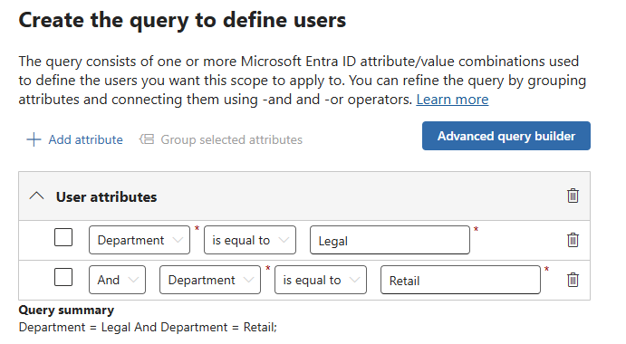

---
lab:
  task: Configure Retention Policies
  exercise: Exercise 1 - Configure Retention Policies
---

## WWL テナント - 使用条件

講師が指導するトレーニング配信の一環としてテナントを提供されている場合は、講師が指導するトレーニングでハンズオンラボをサポートする目的でテナントを利用できることに注意してください。

テナントを共有したり、ハンズオンラボ以外の目的で使用したりしないでください。 このコースで使われるテナントは試用版テナントであり、クラスが終了し、拡張機能の対象となっていない場合は、使用したりアクセスしたりすることはできません。

テナントを有料サブスクリプションに変換することはできません。 このコースの一環として取得したテナントは Microsoft Corporation の財産のままであり、当社はいつでもアクセス権とリポジトリを取得する権利を留保します。

# 演習 1 スキルアップ タスク

このタスクでは、必要な基準を満たす保持ポリシーを作成して管理します。

- **会社全体の保持ポリシー**: 保持期間を適用して、このポリシーの場所を設定します。
- **場所ベースの保持ポリシー**: 特定のユーザーを含む Teams チャネルやチャットなど、特定の場所の保持ポリシーを作成します。
- **PowerShell 保持ポリシー**: PowerShell を使用して保持ポリシーを実装します。
- **アダプティブ スコープ ポリシー**: 法務や小売などの部門を対象とするアダプティブ スコープを持つ保持ポリシーを作成して適用します。

## タスク 1 - 全社的な保持ポリシーを作成する

ここでは、組織全体に適用される保持ポリシーを作成します。

1. Microsoft Edge で、Microsoft Purview ポータル `https://purview.microsoft.com` にアクセスして、ログインします。
1. 新しい Microsoft Purview ポータルに関するメッセージが画面に表示されます。 データ フローの開示条件とプライバシーに関する声明に同意する選択肢を選択してから、**[開始する]** を選択します。

    >![[ようこそ新しい Microsoft Purview ポータルへ] 画面のスクリーンショット。](./Media/welcome-purview-portal.png)

1. **[ソリューション]** > **[データ ライフサイクル管理]** を選択します。
1. 左側のナビゲーション ウィンドウで、**[ポリシー]** を展開してから、**[保持ポリシー]** を選択します。
1. **[+ 新しい保持ポリシー]** を選択します。
1. **[保持ポリシーに名前を付ける]** ページで、名前と説明を入力します。

   - **名前**: `Company wide`
   - **説明**: `All locations except for teams`

1. [**次へ**] を選択します。
1. **[ポリシー スコープ]** ページで、**[次へ]** を選びます。
1. **[作成する保持ポリシーの種類を選択する]** ページで、**[静的]** を選択してから、**[次へ]** を選択します。
1. **[このポリシーを適用する場所を選択する]** ページで、次を有効にします。

   - Exchange メールボックス
   - SharePoint クラシック サイトとコミュニケーション サイト
   - OneDrive アカウント
   - Microsoft 365 グループのメールボックスとサイト

1. [**次へ**] を選択します。
1. **[コンテンツを保持するか、削除するか、またはその両方を行うかを決定する]** ページで、**[特定の期間のアイテムを保持する]** セクションで、次の情報を入力します。

   - **アイテムを特定の期間保持する**: ドロップダウン リストから **[カスタム]** を選択します
   - [年] フィールドを **[3]** に変更します。
   - **保持期間開始の条件**:アイテムが最後に変更されたとき
   - **[保持期間の終了時]** :アイテムを自動的に削除する

1. [**次へ**] を選択します。
1. **[確認と完了]** ページで、**[送信]** を選択します。
1. ポリシーを作成したら、**[完了]** を選択します。

これで、最終変更日から 3 年間アイテムを保持する全社的な保持ポリシーが正常に作成されました。

## タスク 2 - フィルター付きの、場所に基づく保持ポリシーを作成する

ここでは、特定のユーザーのフィルターを含む、Teams チャネルとチャット専用の保持ポリシーを作成します。

1. 引き続き、Microsoft Purview ポータル内の **[保持ポリシー]** スクリーンにいる必要があります。

   いない場合は、Microsoft Edge で、Microsoft Purview ポータルに移動し、`https://purview.microsoft.com` にアクセスして、ログインします。 ログインしたら、**[データ ライフサイクル管理]** > **[ポリシー]** > **[保持ポリシー]** カードを選択します。

1. **[+ 新しい保持ポリシー]** を選択します。
1. **[保持ポリシーに名前を付ける]** ページで、名前と説明を入力します。

   - **名前**: `Teams Retention`
   - **説明**: `Retention for Teams locations`

1. [**次へ**] を選択します。
1. **[ポリシー スコープ]** ページで、**[次へ]** を選びます。
1. **[作成する保持ポリシーの種類を選択する]** ページで、**[静的]** を選択してから、**[次へ]** を選択します。
1. [ポリシーを適用する場所を選択する] セクションで、次を有効にします。

   - Teams チャネル メッセージ
   - Teams チャットと Copilot とのやり取り

   他のすべてのオプションが無効になっていることを確認します。

1. **[Teams チャットと Copilot とのやり取り]** の場所については、**[すべてのユーザー]** の下の **[編集]** リンクを選択し、2 人のユーザーを追加します。

    >![Teams チャットと Copilot とのやり取りの [ユーザーの追加] オプションを示すスクリーンショット。](./Media/add-users-retention-policy.png)

1. **[Teams チャットと Copilot とのやり取り]** ポップアップ ページで、ユーザーが追加されたら、**[完了]** を選択し、**[次へ]** を選択します。
1. **[コンテンツを保持するか、削除するか、または両方を行うかを決定する]** ページで、次を入力します。
   - **アイテムを特定の期間保持する**: ドロップダウン リストから **[カスタム]** を選択します。
   - [年] フィールドを [3] に変更します。
   - **保持期間開始の条件**: アイテムが最後に変更されたとき。

1. [**次へ**] を選択します。
1. **[確認と完了]** ページで、**[送信]** を選択します。
1. ポリシーを作成したら、**[完了]** を選択します。

特定のユーザーにフィルターを適用して、3 年間の保持期間を持つ Teams の場所の保持ポリシーが正常に作成されました。

## タスク 3 - PowerShell で保持ポリシーを作成する

このタスクでは、PowerShell を使用して保持ポリシーを作成および管理します。

1. 管理者特権の PowerShell ウィンドウを開きます。
1. 次のコマンドレットを入力して、Exchange Online PowerShell モジュールの最新版をインストールします。

    ```powershell
    Install-Module ExchangeOnlineManagement
    ```

1. NuGet プロバイダー セキュリティ ダイアログで、[はい] を示す **[Y]** を選択して確定し、**Enter** キーを押します。 この処理は、完了までに時間がかかる場合があります。
1. 信頼されていないレポジトリ セキュリティ ダイアログで、[はい] を示す **[Y]** を選択して確定し、**Enter** キーを押します。  この処理は、完了までに時間がかかる場合があります。
1. 次のコマンドレットを入力して実行ポリシーを変更し、**Enter** キーを押します。 このコマンドは、適切なアクセス許可を持つユーザーとしてログインしていることを前提としています。

    ```powershell
    Set-ExecutionPolicy -ExecutionPolicy RemoteSigned -Scope CurrentUser
    ```

1. [実行ポリシーの変更] で、[はい] を示す **[Y]** を選択して確定し、**Enter** キーを押します。
1. PowerShell ウィンドウを閉じます。
1. マウスの右ボタンで Windows ボタンを選択して通常の PowerShell ウィンドウ (昇格されていない) を開き、 **[Windows PowerShell]** を選択します。
1. 次のコマンドレットを使用して、テナントのセキュリティ/コンプライアンス センターに接続します。

    ```powershell
    Connect-IPPSSession
    ```

1. メッセージが表示されたら、適切なアクセス許可を持つユーザーとしてサインインします。
1. 次のコマンドレットを実行して、Teams を除くすべての場所に対する最初の保持ポリシーを作成します。

    ```powershell
    New-RetentionCompliancePolicy -Name "Company Wide PS" -ExchangeLocation All -ModernGroupLocation All -SharePointLocation All -OneDriveLocation All
    ```

1. 次のコマンドレットを実行して、保持期間を設定します。単位は、変更日を基準にした日数を使用します。

    ```powershell
    New-RetentionComplianceRule -Name "Company Wide PS Rule" -Policy "Company Wide PS" -RetentionDuration 1095 -ExpirationDateOption ModificationAgeInDays -RetentionComplianceAction Keep
    ```

PowerShell を使って保持期間を 3 年に設定した保持ポリシーを正常に作成しました。

<!--- Commenting out until adaptive scope issue is resolved

## Task 4 – Create retention policy with adaptive scope

Here, you will create a retention policy with adaptive scope targeting specific departments like Legal and Retail.

1. In Microsoft Edge, navigate to the Microsoft Purview portal, `https://purview.microsoft.com`, and log in.
1. Select **Settings** from the left navigation bar.
1. Expand **Roles and scopes** then select **Adaptive scopes**.
1. On the **Adaptive scopes** page select **+ Create scope**.
1. On the **Name your adaptive policy scope page**, enter:

   - **Name**: `Legal Documents Retention`
   - **Description**: `Retention for legal related documents`

1. Select **Next**.
1. On the **Assign admin unit page**, select **Next**.
1. On the **What type of scope do you want to create?** page, select **Users** and then **Next**.
1. On the **Create the query to define users** page, under **User attributes**, select:

   - **Attribute**: Department
   - **Operator**: is equal to
   - **Value**: `Legal`

1. Add a second attribute by selecting the **+ Add attribute** button with values:

   - **Query operator**: Or
   - **Attribute**: Department
   - **Operator**: is equal to
   - **Value**: `Retail`

    >

1. Select **Next** and then **Submit** on the **Review and finish** page.
1. Once your scope has been created select **Done** to get back to the **Adaptive scopes** page.
1. Select **Solutions** > **Data Lifecycle Management**.
1. Expand **Policies** then select **Retention policies**.
1. On the **Retention policies** page select **+ New retention policy**.
1. On the **Name your retention policy page**, enter:

   - **Name**: `Legal Data Retention`
   - **Description**: `Retention of all documents within the legal and retail departments.`

1. Select **Next**.
1. On the **Policy Scope** page, select **Next**.
1. On the **Choose the type of retention policy to create** page, select **Adaptive** and then **Next**.
1. On the **Choose adaptive policy scopes and locations** page, select **+ Add scopes** and choose the **Legal Documents Retention** scope.
1. Under **Choose locations to apply the policy** enable:

   - Exchange mailboxes
   - OneDrive accounts

1. Select **Next**.
1. On the **Decide if you want to retain content, delete it, or both** page, enter:

   - **Retain items for a specific period**: 5 years
   - **Start the retention period based on**: When items were created
   - **At the end of the retention period**: Do nothing

1. Select **Next** and then **Submit** on the **Review and finish**.
1. Once your policy is created, select **Done**.

You have successfully applied an adaptive scope to a retention policy.

--->
