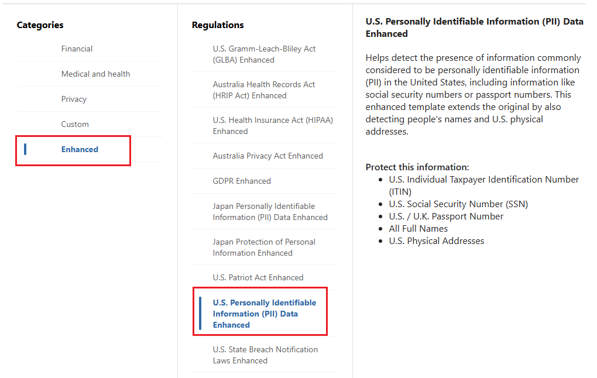

---
lab:
  task: Create retention labels
  exercise: Exercise 2 - Create retention labels
---

## WWL テナント - 使用条件

講師が指導するトレーニング配信の一環としてテナントを提供されている場合は、講師が指導するトレーニングでハンズオンラボをサポートする目的でテナントを利用できることに注意してください。

テナントを共有したり、ハンズオンラボ以外の目的で使用したりしないでください。 このコースで使われるテナントは試用版テナントであり、クラスが終了し、拡張機能の対象となっていない場合は、使用したりアクセスしたりすることはできません。

テナントを有料サブスクリプションに変換することはできません。 このコースの一環として取得したテナントは Microsoft Corporation の財産のままであり、当社はいつでもアクセス権とリポジトリを取得する権利を留保します。

# 演習 2 スキルアップ タスク

このタスクでは、必要な基準を満たす保持ラベルを作成して管理します。

- **保持ラベルの作成**: さまざまな種類のドキュメントやメールの保持ラベルを設定します。
- **保持ラベルの発行**: 保持ラベルをユーザーが適用できるようにします。
- **保持ラベルの自動適用**: 特定の条件に基づいて保持ラベルを自動的に適用するように構成します。

## タスク 1 - 保持ラベルを作成する

このタスクでは、ドキュメントやメールに割り当てることができる保持ラベルを作成します。

1. Microsoft Edge で、Microsoft Purview ポータル `https://purview.microsoft.com` にアクセスして、ログインします。
1. **[すべてのソリューションを表示]** を選択します。
1. **[リスクとコンプライアンス]** で、**[レコード管理]** カードを選択します。
1. 左側のナビゲーション ウィンドウで、**[ファイル計画]** を選択します。
1. **[ファイル計画]** ページで **[+ ラベルの作成]** を選択します。
1. **[保持ラベルに名前を付ける]** ページで以下を入力します。

    - **名前**: `Financial Records`
    - **ユーザー向けの説明**: `Assign this label to financial documents to ensure they are retained for the required period.`
    - **管理者向けの説明**: `Financial records with retention period.`
1. [**次へ**] を選択します。
1. **[このラベルのファイル計画記述子の定義]** ページで、**[次へ]** を選択します。
1. **[Define label settings] (ラベル設定の定義)** ページで、**[Retain items forever or for a specific period] (アイテムを無期限に、または特定の期間保持する)** を選択し、**[次へ]** を選択します。

1. **[Define the period] (期間の定義)** で、以下を入力します。

    - **[How long is the period?](期間の長さ)** : 7 年
    - **[When should the period begin?](期間を開始するタイミング)** : アイテムが作成されたとき
1. [**次へ**] を選択します。
1. **[保持期間中の処理の選択]** ページで **[ユーザーが削除してもアイテムを保持する]** を選択してから、**[次へ]** を選択します。
1. **[保持期間後の処理の選択]** ページで **[保持設定の非アクティブ化]** を選択し、**[次へ]** を選択します。
1. **[確認と完了]** ページで、**[ラベルの作成]** を選びます。
1. **[保持ラベルが作成されました]** ページで、**[何もしない]** を選択してから、**[完了]** を選択します。 ラベルは、演習の後半で発行されます。
1. **[ファイル計画]** ページに戻り、**[+ ラベルの作成]** を選択して別の保持ラベルを作成します。
1. **[保持ラベルに名前を付ける]** ページで以下を入力します。

    - **名前**: `HR Records`
    - **ユーザー向けの説明**: `This label is auto-applied to HR records with a retention period of five years.`
    - **管理者向けの説明**: `Auto-applied retention label for HR records.`
1. [**次へ**] を選択します。
1. **[このラベルのファイル計画記述子の定義]** ページで、**[次へ]** を選択します。
1. **[Define label settings] (ラベル設定の定義)** ページで、**[Retain items forever or for a specific period] (アイテムを無期限に、または特定の期間保持する)** を選択し、**[次へ]** を選択します。
1. **[Define the period] (期間の定義)** で、以下を入力します。

    - **期間はどれくらいですか?**: 5 年
    - **[When should the period begin?](期間を開始するタイミング)** : アイテムが作成されたとき
1. [**次へ**] を選択します。
1. **[保持期間中の処理の選択]** ページで **[ユーザーが削除してもアイテムを保持する]** を選択してから、**[次へ]** を選択します。
1. **[保持期間後の処理の選択]** ページで **[保持設定の非アクティブ化]** を選択してから、**[次へ]** を選択します。
1. **[確認と完了]** ページで、**[ラベルの作成]** を選択します。
1. **[保持ラベルが作成されました]** ページで、**[何もしない]**、**[完了]** の順に選びます。

保持期間が 7 年間の財務レコード用の保持ラベルと、保持期間が 5 年間の HR レコード用の保持ラベルが正常に作成されました。

## タスク 2: 保持ラベルを発行する

タスク 1 に続いて、保持ラベルを発行します。これにより、発行されたラベルをユーザーが Exchange メールや SharePoint ドキュメントにあるドキュメントに適用できるようになります。

1. 引き続き Microsoft Purview ポータル内の **[ファイル計画]** ページにいる必要があります。

   いない場合は、Microsoft Edge で、Microsoft Purview ポータルに移動し、`https://purview.microsoft.com` にアクセスして、ログインします。 **[すべてのソリューションの表示]** を選択し、**[レコード管理]** > **[ファイル計画]** を選択します。

1. **[財務レコード]** 保持ラベルの横にあるチェック マークをオンにしてから、**[ラベルの発行]** ボタンを選択します。

    >![保持ラベルと [ラベルの発行] ボタンを選択する場所を示すスクリーンショット。](./Media/publish-labels.png)

1. **[発行するラベルの選択]** ページに、**[財務レコード]** 保持ラベルが表示されます。
1. [**次へ**] を選択します。
1. **[Policy Scope] (ポリシー スコープ)** ページで、**[次へ]** を選択します。
1. **[作成するアイテム保持ポリシーの種類を選択する]** ページで **[静的]** を選択し、**[次へ]** を選択します。
1. **[Choose where to publish labels] (ラベルを発行する場所の選択)** ページで、**[特定の場所を選択]** を選んで、以下を有効にします。

   - Exchange メールボックス
   - SharePoint クラシック サイトとコミュニケーション サイト
   - OneDrive アカウント

1. Microsoft 365 グループのメールボックスとサイトが**オフ**に設定されていることを確認してから、**[次へ]** を選択します。
1. **[ポリシーに名前をつける]** ページで、以下を入力します。

   - 名前: `Financial Records Retention Label`
   - 説明: `Retention label for financial records with a seven-year retention period.`
1. [**次へ**] を選択します。
1. **[完了]** ページで **[送信]** を選択します。
1. **[保持ラベルが発行されました]** ページで、**[完了]** を選びます。

財務レコードの保持ラベルが正常に発行されました。

## タスク 3 - 自動適用保持ラベルを発行する

タスク 1 に引き続き、情報が保持されるように、HR レコードの保持ラベルを自動適用します。

1. 引き続き Microsoft Purview ポータル内の **[レコード管理]** にいる必要があります。 

   いない場合は、Microsoft Edge で、Microsoft Purview ポータルに移動し、`https://purview.microsoft.com` にアクセスして、ログインします。 **[すべてのソリューションの表示]** を選択してから、**[レコード管理]** を選択します。

1. 左側のナビゲーション ウィンドウで、**[ポリシー]** を展開してから、**[ラベル ポリシー]** を選択します。
1. **[ラベルの自動適用]** を選択して、**[自動ラベル付けポリシーの作成]** 構成を開始します。
1. **[作業の開始]** ページの **[名前]** と **[説明]** に次の情報を入力します。

   - **名前**: `HR Records auto-applied`
   - **説明**: `HR Records auto-applied retention label, with a retention period of five years for all locations.`
1. [**次へ**] を選択します。
1. **[このラベルを適用するコンテンツの種類を選択する]** ページで、**[機密情報が含まれているコンテンツにラベルを適用する]** を選択し、**[次へ]** を選択します。
1. **[機密情報を含むコンテンツ]** ページで、**[強化]** カテゴリと **[米国個人情報 (PII) データ強化規制]** を選択してから、**[次へ]** を選択します。

    >

1. **[機密情報を含むコンテンツを定義する]** ページで、既定の設定を選択したままにしてから、**[次へ]** を選択します。
1. **[Policy Scope] (ポリシー スコープ)** ページで、**[次へ]** を選択します。
1. **[作成するアイテム保持ポリシーの種類を選択する]** ページで **[静的]** を選択し、**[次へ]** を選択します。
1. **[ポリシーを適用する場所を選択する]** ページで、次用のオプションを有効にします。

   - Exchange メールボックス
   - SharePoint クラシック サイトとコミュニケーション サイト
   - OneDrive アカウント
   - Microsoft 365 グループのメールボックスとサイト

1. [**次へ**] を選択します。
1. **[自動適用するラベルを選択する]** ページで **[ラベルの追加]** を選択します。
1. 右側の **[ラベルの選択] **ポップアップ ページで、**[HR レコード]** の横にあるチェック ボックスをオンにしてから、**[追加]** を選択します。
1. **[自動適用するラベルを選択する]** ページで、**[次へ]** を選択します。
1. **[ポリシーをテストするか実行するかを決定する]** で、**[ポリシーをオンにする]** を選択して、**[次へ]** を選択します。
1. **[確認と完了]** ページで、**[送信]** を選択します。 ポリシーが作成されたら、**[完了]** を選択します。

自動適用で保持ラベルが正常に発行されました。 今後 7 日間にわたって、関連するすべてのドキュメントに発行済みラベルが自動的に付けられます。
