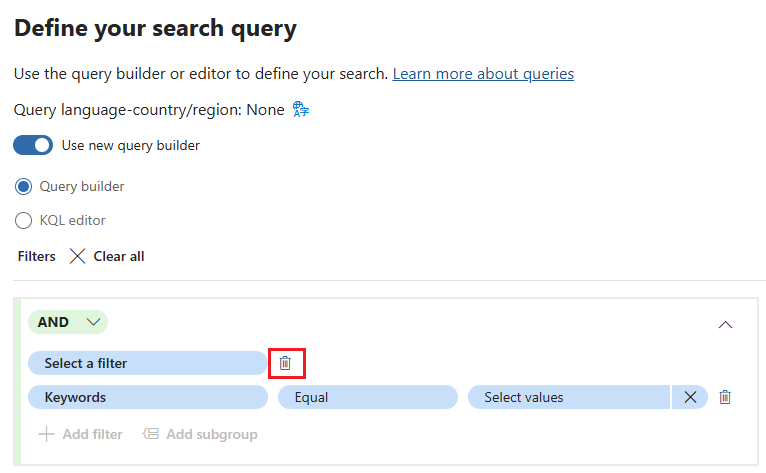

---
lab:
  task: Case investigation with eDiscovery (Premium)
  exercise: Exercise 3 - Case investigation with eDiscovery (Premium)
---

## WWL テナント - 使用条件

講師が指導するトレーニング配信の一環としてテナントを提供されている場合は、講師が指導するトレーニングでハンズオンラボをサポートする目的でテナントを利用できることに注意してください。

テナントを共有したり、ハンズオンラボ以外の目的で使用したりしないでください。 このコースで使われるテナントは試用版テナントであり、クラスが終了し、拡張機能の対象となっていない場合は、使用したりアクセスしたりすることはできません。

テナントを有料サブスクリプションに変換することはできません。 このコースの一環として取得したテナントは Microsoft Corporation の財産のままであり、当社はいつでもアクセス権とリポジトリを取得する権利を留保します。

# 演習 3 スキルアップ タスク

このタスクでは、調査基準を満たす電子情報開示ケースを作成して管理します。

- **新しい電子情報開示ケースを作成する**: 新しいケースを設定して調査を開始します。
- **ケースにカストディアンを追加する**: 関連するデータを持っている可能性がある関連する個人を含めます。
- **コレクションの見積もりを作成して実行する**: 調査のデータ量と関連性を分析します。
- **コレクションの見積もりを見直して改善する**: コレクションが基準を満たしていることを確認します。
- **コレクションをレビュー セットにコミットする**: 詳細な分析のためにデータを準備します。
- **検索結果をエクスポートする**: さらなるレビューとコンプライアンスのために収集したデータを保存します。

>**注**: このラボでは、調査を行うために探索するデータを含む M365 E5 テナントへのアクセスを前提としています。 データなしでこの演習を進めることもできますが、コレクションとレビュー セットは何の結果も生みません。

## タスク 1 - 電子情報開示 (Premium) のアクセス許可を付与する

ファイルをエクスポートするには、このオプションがユーザー ファイルに付与する直接アクセスのために、特定のアクセス許可が必要です。

1. Microsoft Edge で、Microsoft Purview ポータル `https://purview.microsoft.com` にアクセスして、ログインします。
1. 左側のナビゲーション ウィンドウから **[設定]** を選択します。
1. 左側のナビゲーション ウィンドウで、**[ロールとスコープ]** を展開し、**[ロール グループ]** を選択します。
1. **[Microsoft Purview ソリューションのロール グループ]** で、**[電子情報開示マネージャー]** を選択します。
1. 右側の **[電子情報開示マネージャー]** ポップアップ ページで、**[編集]** を選択します。
1. **[Manage eDiscovery Manager] (電子情報開示マネージャーの管理)** ページで、**[ユーザーの選択]** を選択します。
1. 右側の **[ユーザーの選択]** ポップアップ ページで、次のステップで電子情報開示調査を行うのに使用するユーザーを選択し、**[選択]** を選択します。

    >**注**: データを確認して検索結果をエクスポートするユーザーを選択してください。

1. **[電子情報開示マネージャーの管理]** ページで、**[次へ]** を選択します。
1. **[Manage eDiscovery Administrator] (電子情報開示管理者の管理)** ページで、**[次へ]** を選択します。
1. **[ロール グループを確認して完了する]** ページで、**[保存]** を選択して、電子情報開示マネージャー ロール グループにユーザーを追加します。
1. ロール グループにユーザーを正常に追加したら、**[ロール グループが正常に更新されました]** ページで **[完了]** を選択します。

電子情報開示マネージャーのアクセス許可が正常に付与されました。

## タスク 2 - 電子情報開示 (Premium) ケースを作成する

必要なアクセス許可が得られたので、新しい電子情報開示ケースを作成して調査を開始できます。

1. Microsoft Purview で、**[ソリューション]**、**[電子情報開示]** の順に選択します。

   すると、**電子情報開示 (Premium)** の**クラシック** エクスペリエンスに直接移動します。

1. **電子情報開示 (Premium)** のページの**ケース**に関するタブで、**[+ ケースを作成]** を選択します。
1. 右側の **[ケースに名前を付ける]** ポップアップ ページで、次の情報を入力します。

   - **名前**: `Legal Investigation 2024`
   - **説明**: `eDiscovery case for the 2024 legal investigation involving relevant emails and documents.`

1. [**次へ**] を選択します。
1. **[チーム メンバーを追加して設定を構成する]** ページで、調査を行うユーザーを追加していることを確認し、**[次へ]** を選択します。
1. **[ケースを確認する]** ページで、**[送信]** を選択してから、**[完了]** を選択します。

これで、_2024 年法的調査_という名前の新しい電子情報開示ケースが正常に作成されました。

## タスク 3 - ケースにカストディアンを追加する

ケースが作成されたので、カストディアンを追加する必要があります。 カストディアンは、調査に関連する情報を持っている可能性のある個人です。

1. 前のタスクでケースを作成した後は、**2024 年法的調査**ケースの **[概要]** タブが表示されます。
1. 上部のナビゲーションから **[データ ソース]** タブを選択してから、**[データ ソースの追加]** > **[新しいカストディアンの追加]** を選択します。
1. **[新しいカストディアン]** ポップアップ ページの **[カストディアンの選択]** で、ケースにカストディアンを追加してから、**[次へ]** を選択します。
1. **[設定を保留にする]** ページで、前の手順で追加したカストディアンが保留になるように選択されていることを確認します。
1. **[カストディアンを確認する]** ページで、**[送信]** を選択し、新しいカストディアンが作成されたら、**[完了]** を選択します。

これで、_2024 年法的調査_ケースにカストディアンが正常に追加されました。

## タスク 4 - コレクションの見積もりを作成して実行する

カストディアンが追加されたので、コレクションの見積もりを実行して、データ ボリュームと関連性の概要を取得できるようになりました。

1. 前のタスクのケースにカストディアンを追加した後も、**2024 年法的調査**ケースの **[データ ソース]** タブにいる必要があります。  
1. 上部のナビゲーションから **[コレクション]** タブを選択してから、**[+ 新しいコレクション]** を選択します。
1. **[新しいコレクション]** 構成で、コレクションに**名前と説明**を付けます。 次を入力します。

   - **名前**: `Legal Data Collection`
   - **説明**: `Collecting emails and documents relevant to the 2024 legal investigation.`

1. [**次へ**] を選択します。
1. **[カストディアンのデータ ソースの選択]** で、**[+ カストディアンの選択]** を選択します。
1. 右側の **[カストディアンを選択する]** ポップアップ ページで、前のタスクでケースに追加されたカストディアンを追加してから、**[追加]** を選択します。
1. **[カストディアンのデータ ソースの選択]** ページに戻り、**[次へ]** を選択します。
1. **[非カストディアンのデータ ソースの選択]** で、**[次へ]** を選択します。
1. **[追加の場所]** で、次の場所の状態を **[オン]** に設定します。

   - Exchange メールボックス
   - Exchange パブリック フォルダー

1. [**次へ**] を選択します。
1. **[検索クエリを定義する]** ページで、クエリ ビルダーを使用して検索を作成し、ケースに関連するコンテンツを検索します。

   - **AND** 演算子を使用して、`legal` と**同じ****キーワード**を検索します。

    >**注**: **法的事項**に等しいキーワードを検索するのに、検索クエリを作成した後に**フィルターを選択**するオプションを削除することが必要になる場合があります。 このオプションがあると、次の手順でサブグループを追加できなくなります。
    >

   - **[サブグループの追加]** を選択します。
   - **OR** 演算子を使用して、`contract` と**同じ****キーワード**を検索します。

    >

1. [**次へ**] を選択します。
1. **[コレクションを確認して作成する]** ページで、**[送信]** を選択してから、**[新しいコレクションが作成されました]** ページで **[完了]** を選択します。
1. **[コレクション]** ページに戻り、コレクションの見積もりの進行状況を確認します。 **[更新]** ボタンを使用してページを更新し、コレクションの見積もりの状態を確認します。 見積もりの状態が **[見積もり済み]** に更新され、**[プレビュー] 状態**が **[成功]** に更新されると、コレクションの見積もりが完了します。

    >![[更新] ボタンとコレクションの見積もり状態を示すスクリーンショット。](./Media/collection-estimate-status.png)

    >**ヒント**: コレクションの見積もりが完了したら、さまざまなクエリを作成するか、KQL エディターを使用してより高度な検索を試してみてください。 これを行うには、コレクションの見積もりの左側にあるチェックボックスを選択し、**[コレクションの編集]** を選択します。 これにより、**[検索クエリの定義]** ページに直接移動します。 クエリを変更し、新しいコレクションの見積もりを送信して、クエリによってコレクションの見積もりがどのように変更されるかを確認することができます。

1. **[法的データ コレクション]** を選択し、コレクションの見積もりを確認します。

   - **[概要] タブ**: 取得された項目、ヒットがある場所、ファイルの種類など、コレクションの統計情報の概要を示します。
   - **[データ ソース] タブ**: コレクションに含まれるカストディアン データ ソースと非カストディアン データ ソースに関する情報が表示されます。
   - **[統計の検索] タブ**: 項目数やデータ量など、前回のコレクションの見積もりからの詳細な統計情報が表示されます。
   - **[コレクション オプション] タブ**: クラウドの添付ファイルや会話スレッドなど、コレクションを構成するときに使用できるさまざまなオプションを一覧表示し、説明します。

    >

これで、_法的データ コレクション_という名前のコレクションが正常に作成され、確認されました。

## タスク 5 - コレクションをレビュー セットにコミットする

コレクションに問題がなければ、詳細な分析のためにレビュー セットにコミットします。

1. 前のタスクでコレクションの見積もりを作成した後も、**2024 年法的調査**ケースの **[コレクション]** タブが表示されます。  
1. **[法的データ コレクション]** コレクションを選択します。
1. 右側の **[法的データ コレクション]** ポップアップ パネルで、**[コレクションのコミット]** を選択します。
1. **[レビュー セットへのアイテムのコミット]** ページで、**[新しいレビュー セットに追加する]** オプションが選択されていることを確認し、`Legal Case Review` と名前を付けます。
1. 他の既定値を選択したまま、**[コミット]** を選択して、コレクションをレビュー セットにコミットします。

コレクションがレビュー セットに正常にコミットされました。

## タスク 6 - レビュー セットを確認する

1. 前のタスクのレビュー セットにコレクションをコミットした後も、**2024 年法的調査**ケースの **[コレクション]** タブにいる必要があります。
1. 上部のナビゲーションから **[レビュー セット]** タブを選択してから、新しく作成した **[法的ケース レビュー]** レビュー セットを選択します。
1. 右側の **[法的ケース レビュー]** ポップアップ ページで、ページの下部にある **[レビュー セットを開く]** を選択します。
1. レビュー セット内のアイテムでできることについて確認します。

   1. **フィルター**: 条件を適用して、レビュー セットに表示される項目を絞り込みます。
   1. **タグ**: 特定のタグを使用して、ドキュメントにラベルを付けて、より適切な整理と識別を行うことができます。
   1. **グループ**: 家族や会話などの関連アイテムごとにレビュー セットのコンテンツを整理できます。
   1. **ソースの表示**: 選択したドキュメントを元の形式で表示し、豊富なビューを提供します。
   1. **プレーンテキストの表示**: 埋め込まれた画像と書式設定を無視して、ドキュメントの抽出されたテキストを表示します。
   1. **注釈**: ユーザーが文書にマークアップ、編集、その他の注釈を適用できるようにします。
   1. **メタデータの表示**: 選択したドキュメントに関連付けられているさまざまなメタデータを表示して、詳細な分析情報を得ることができます。

    >

1. レビュー セットを調べ終えたら、項目をエクスポートして詳細な分析を行うことができます。

これで、レビュー セットが正常に開いてレビューされました。

## タスク 7 - 検索結果をエクスポートする

作業内容を保存して詳細な分析を有効にするには、検索結果をエクスポートします。

1. 引き続き、電子情報開示 (Premium) の **[法的ケース レビュー]** レビュー セットにいる必要があります。
1. 詳細な分析のためにエクスポートする項目の横にあるチェックボックスをオンにします。
1. **[アクション]** > **[エクスポート]** のドロップダウンを選択します。

    >

1. 右側の **[エクスポート オプション]** ポップアップ ページで、次のように入力します。

   - **エクスポート名**: `LegalCaseExport_July2024`
   - **説明**: `Export of relevant emails and documents for the July 2024 legal case investigation.`
   - **これらのドキュメントをエクスポートする**: 選択したドキュメントのみ
   - **選択を拡大する**: なし
   - **出力オプション**: 圧縮されたディレクトリ構造

1. ポップアップ ページの下部にある **[エクスポート]** ボタンを選択します。

    >

1. レビュー セットをエクスポートするために、**ジョブが作成された**という通知が表示されます。 この通知上の **[OK]** を選択します。
1. エクスポートしたレビュー セットにアクセスするには、左側のナビゲーション ウィンドウから **[Premium ケース]** を展開してから、**[ケース]** を選択します。 上部のナビゲーションから **[2024 年法的調査]** ケースを選択してから、**[エクスポート]** タブを選択します。
1. **[LegalCaseExport_July2024]** エクスポートを選択します。
1. 右側の **[LegalCaseExport_July2024]** ポップアップ ページで、エクスポートされた各ファイルの左側にあるチェックボックスをオンにし、**[ダウンロード]** を選択します。 これにより、エクスポートされたアイテムの .csv の概要と zip ファイルがダウンロードされます。

    >**ヒント**: エクスポートされたファイルを正常にダウンロードするには、ポップアップ ブロックを無効にする必要がある場合があります。

検索結果が正常にエクスポートされ、レビューが行われます。
